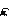

# Welcome to the NOID GitHub page!

NOID is a dungeon-crawling adventure game developed by **Karl Olma** and **Jonathan Gurkan** using GameMaker Language. Dive into an action-packed world where you explore mysterious dungeons, defeat enemies, and capture Power Cards to upgrade your character's abilities.

## Features

*   **Dungeon:** Conquer dungeons filled with challenges.
*   **Combat System:** Engage in battles against enemies and powerful bosses.
*   **Upgrade System:** Collect Power Cards to enhance your character’s Health, Stamina, Strength, and Defense. Each category features up to six upgrades, allowing for strategic customization.
*   **Challenging Gameplay:** Plan your upgrades carefully—each Power Card can only be used for up to three or four upgrades.

## Gameplay Mechanics

1.  **Game controls:**
    *   You control the player with WASD and mouse buttons which leads to easy to master controls.
    *   You attack with left mouse button, while Shift helps you to escape dodgy situations with a great dash.
    *   The player (who's name is not known hence the name NOID) has two swords. He can attack with them and parry enemy attacks.
    *   Player health is 100 hitpoints but can be upgraded with Power Cards.
    *   Enemy hitpoints vary between 2 and 15 hitpoints depending on the type of enemy. 
2.  **Characters:**
    *   *Player:* 
        *   The player is a girl dressed in yellow, she has two swords and has the ability to attack and parry with the swords.
        
    *   *Enemies:*
        *   There will be a total of 5 enemies in the game:
            * **B.O.T:** B.O.T is a robot with two attacks: Fire dash and shoot. With the fire dash, B.O.T dashes towards the player dealing damage to the player and also knocking him back. The shoot attack is like the name suggests; B.O.T tries to shoot a projectile to the player, but only gunpowder comes out. It deals damage but not that much in comparison to a normal gunshot.  
              
            *  **Flamethrower:** Flamethrower has only one main attack: using his flamethrower to damage the player. If the player walks into the fire, he takes damage.  
                 
            *  **Flower:** Flower is one of the smallest enemies in the game. It can hide in the ceiling or just stay on the ground but either way, he will approach the player and damage him with the steam that comes out of him. 
                
            *  **Flashbang:** Flashbang is the smallest enemy in the game. This little guy is a suicide bomber. It appears from out of the ground and goes to the player. When he is near enough, his antenna will shine so bright that the poor dude with explode. 
                
            *   **Mage**: Mage is the most complex enemy in the game. This fella has not one, not two but three moves he can throw at the player. First is the blast: he shoots a blast from his gun towards the player which deals significant damage. Second is the close range attack: when the player comes too close, Mage will shoot a small blast from his gun to knock the player back, while directly after he will do his third move: Mage dashes backwards to avoid any attacks the player throws at him. 
              
3.  **Room design:** Instead of a traditional level design, we went for a progressive room design. The player wakes up in his first dungeon and learns how to do basic movement, combat and parcour. Our plan is to make ## rooms in total. This we think is a reasonal size to make before our deadline. With this amount of rooms the player will have plenty of room to play in. Every # rooms the player will encounter a boss that will give him a Power card which will give the opportunity to upgrade one of his abilties. Each boss will be progressively harder.
4.  **Gameplay and balance:** To maintain equal balance throughout the game, enemies will give rewards based on how hard it was for the player to kill them. Rewards could be Slices of Power, coins, health or stamina. Slices of Power are the building blocks of Power Cards. With a total of 3 Slices of Power the player gets one Power Card.
   * **Upgrade Categories with Power Cards:**
       *   **Health:** Increases your survivability.
       *   **Stamina:** Improves endurance for actions like dodging or running.
       *   **Strength:** Boosts your attack power.
       *   **Defense:** Enhances your ability to take hits.
5. **Sound:** [THIS SECTION STILL NEEDS TO BE ADDED]     

## Cheats and extras
* When `F12` is pressed once you can switch between the different rooms with `1, 2, 3 etc...`
* Around the game there are secret entrances that lead to different parts of the game

*   **Explore** the dungeon and uncover its secrets.
*   **Defeat** enemies and bosses to gather Power Cards.
*   **Upgrade** your abilities strategically to prepare for tougher challenges.

## Requirements

*   GameMaker Studio 2 or higher (for developers).
*   PC or Mac for playing the game.

## Development Team

*   **Karl:** Developer
*   **Jonathan:** Developer

## Status

NOID is currently in development. Stay tuned for updates, including new features, improvements, and bug fixes! We are planning to finish a playable version of the game on the 7th of February and the final version on 6 March.

## Feedback

We’d love to hear your feedback! Please share your thoughts and suggestions by contacting us at:

*   **Karl’s Email:** s932051@cartesius.espritscholen.nl
*   **Jonathan’s Email:** j.gurkan@cartesius.espritscholen.nl

## License

This project is for educational and personal purposes. Redistribution or commercial use is not permitted without permission from the developers.

## Flowcharts
Along the way of programming the enemies, we've come up with flowcharts to better understand the logic. You can see them here:

